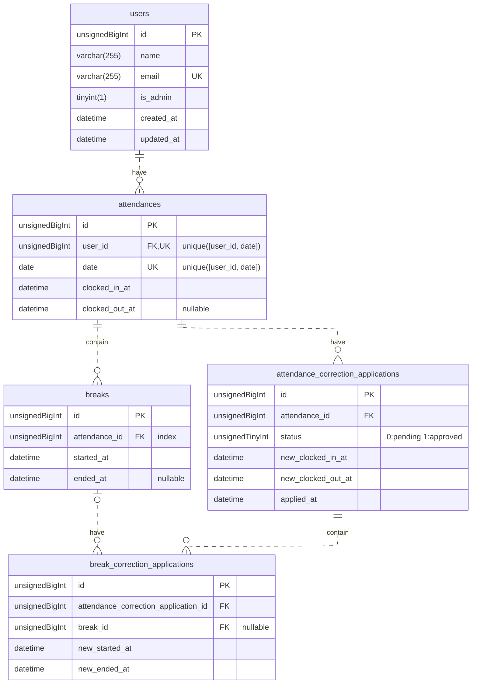

# 模擬案件「勤怠管理システム」

## 概要

プログラミング学習のための勤怠管理システム。一般ユーザー（スタッフ）は勤怠登録（打刻）、勤怠一覧確認、勤怠修正申請などの機能を使用でき、管理者ユーザーは一般ユーザーの勤怠情報の閲覧や修正、修正申請の確認などができる。

## 使用技術

- Laravel 13.7.0
- PHP 8.5.5
- Mysql 8.4.9
- Mailpit v1.29.7
- Node 24.15.0

## ER図

