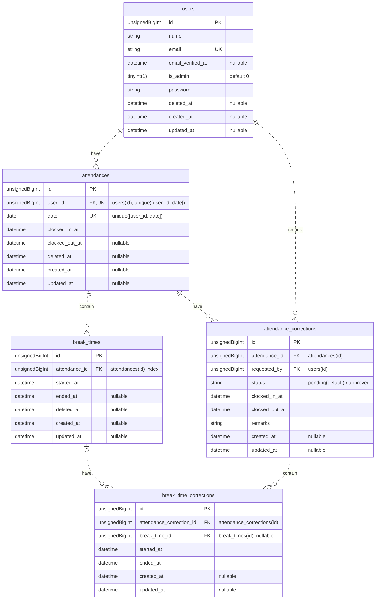

# 模擬案件「勤怠管理アプリ」

## 概要

一般ユーザーは勤怠登録（打刻）、勤怠一覧確認、勤怠修正申請などが可能であり、
管理者は一般ユーザーの勤怠情報の閲覧、修正および修正申請の承認などができる。

## 使用技術

- Laravel
- PHP 8.5
- Mysql 8.4.9
- Mailpit v1.29.7
- Node.js

## 環境構築の手順

- `Docker`を起動
- `make init`
- (テストを実行する場合)`sail test`

## URL

- 開発環境: `http://localhost/`
- `Mailpit`: `http://localhost:8025`

## ER図

```mermaid
erDiagram
    users ||..o{ attendances: "have"
    users ||..o{ attendance_corrections: "request"
    attendances ||..o{ break_times: "contain"
    attendances ||..o{ attendance_corrections: "have"
    break_times |o..o{ break_time_corrections: "have"
    attendance_corrections ||..o{ break_time_corrections: "contain"

    users {
        unsignedBigInt id PK
        string name
        string email UK
        datetime email_verified_at "nullable"
        tinyint(1) is_admin "default 0"
        string password
        datetime deleted_at "nullable"
        datetime created_at "nullable"
        datetime updated_at "nullable"
    }

    attendances {
        unsignedBigInt id PK
        unsignedBigInt user_id FK, UK "users(id), unique([user_id, date])"
        date date UK "unique([user_id, date])"
        datetime clocked_in_at
        datetime clocked_out_at "nullable"
        datetime deleted_at "nullable"
        datetime created_at "nullable"
        datetime updated_at "nullable"
    }

    break_times {
        unsignedBigInt id PK
        unsignedBigInt attendance_id FK "attendances(id) index"
        datetime started_at
        datetime ended_at "nullable"
        datetime deleted_at "nullable"
        datetime created_at "nullable"
        datetime updated_at "nullable"
    }

    attendance_corrections {
        unsignedBigInt id PK
        unsignedBigInt attendance_id FK "attendances(id)"
        unsignedBigInt requested_by FK "users(id)"
        string status "pending(default) / approved"
        datetime clocked_in_at
        datetime clocked_out_at
        string remarks
        datetime created_at "nullable"
        datetime updated_at "nullable"
    }

    break_time_corrections {
        unsignedBigInt id PK
        unsignedBigInt attendance_correction_id FK "attendance_corrections(id)"
        unsignedBigInt break_time_id FK "break_times(id), nullable"
        datetime started_at
        datetime ended_at
        datetime created_at "nullable"
        datetime updated_at "nullable"
    }
```

## ログイン情報

|      項目      |   一般ユーザー   |      管理者       |
| :------------: | :--------------: | :---------------: |
| メールアドレス | user@example.com | admin@example.com |
|   パスワード   |     password     |     password      |

## その他

### 仕様書からの変更点

- `Mailhog`や`Mailtrap`の代わりに`Mailpit`を使用
- 日時取得機能およびステータス確認機能のテストコードはともに`tests/Feature/TimeLogs/CreateTest.php`にて実装
- 修正申請をした際に、修正箇所がない場合は、「修正箇所がありません」というメッセージを表示し修正申請を行わない
