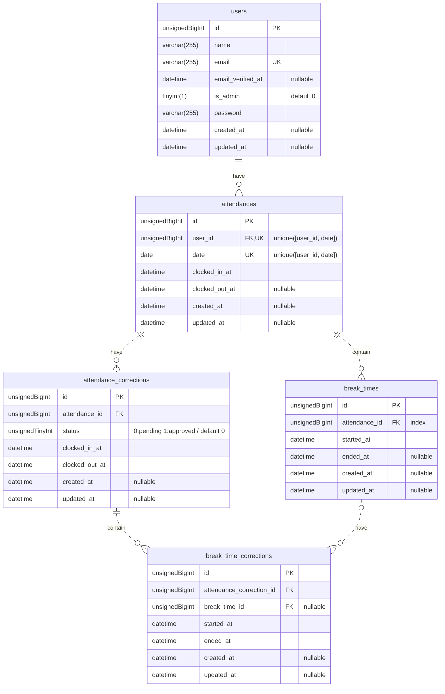

# 模擬案件「勤怠管理システム」

## 概要

プログラミング学習のための勤怠管理システム。
一般ユーザー（スタッフ）は勤怠登録（打刻）、勤怠一覧確認、勤怠修正申請などの
機能を使用でき、管理者ユーザーは一般ユーザーの勤怠情報の閲覧や修正、修正申請
の承認などができる。

## 使用技術

- Laravel 13.7.0
- PHP 8.5
- Mysql 8.4.9
- Mailpit v1.29.7
- Node 24.15.0

## 環境構築の手順

- `Docker`を起動
- `make init`

## URL

- 開発環境: `http://localhost/`
- `Mailpit`: `http://localhost:8025`

## ER図

```mermaid
erDiagram
    users ||..o{ attendances: "have"
    attendances ||..o{ break_times: "contain"
    attendances ||..o{ attendance_corrections: "have"
    attendance_corrections ||..o{ break_time_corrections: "contain"
    break_times |o..o{ break_time_corrections: "have"

    users {
        unsignedBigInt id PK
        varchar(255) name
        varchar(255) email UK
        datetime email_verified_at "nullable"
        tinyint(1) is_admin "default 0"
        varchar(255) password
        datetime created_at "nullable"
        datetime updated_at "nullable"
    }

    attendances {
        unsignedBigInt id PK
        unsignedBigInt user_id FK, UK "unique([user_id, date])"
        date date UK "unique([user_id, date])"
        datetime clocked_in_at
        datetime clocked_out_at "nullable"
        datetime created_at "nullable"
        datetime updated_at "nullable"
    }

    break_times {
        unsignedBigInt id PK
        unsignedBigInt attendance_id FK "index"
        datetime started_at
        datetime ended_at "nullable"
        datetime created_at "nullable"
        datetime updated_at "nullable"
    }

    attendance_corrections {
        unsignedBigInt id PK
        unsignedBigInt attendance_id FK
        unsignedTinyInt status "0:pending 1:approved / default 0"
        datetime clocked_in_at
        datetime clocked_out_at
        datetime created_at "nullable"
        datetime updated_at "nullable"
    }

    break_time_corrections {
        unsignedBigInt id PK
        unsignedBigInt attendance_correction_id FK
        unsignedBigInt break_time_id FK "nullable"
        datetime started_at
        datetime ended_at
        datetime created_at "nullable"
        datetime updated_at "nullable"
    }
```

## ログイン情報

|      項目      |   一般ユーザー    |      管理者       |
| :------------: | :---------------: | :---------------: |
| メールアドレス | staff@example.com | admin@example.com |
|   パスワード   |     password      |     password      |

## その他

### 仕様書からの変更点

- `Mailhog`や`Mailtrap`の代わりに`Mailpit`を使用
